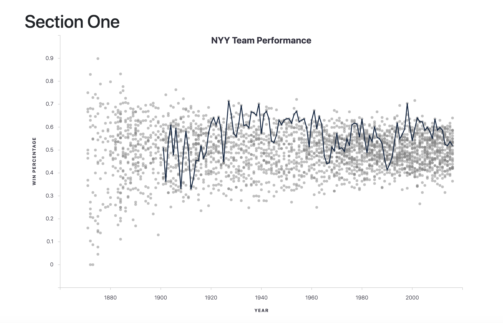

# History-of-Baseball
A Web Display of Historical Baseball Data

### Description
This project is intended to detail the history of the current 30 Major League Baseball franchises.  The first graph details the winning percentage for each season for a given franchise versus all other historical teams.

The second and third graphs detail career franchise hitting and pitching leaders respectively.  The top 10 leaders can be seen for a variety of selectable hitting or pitching statistics.

### File Structure
 - The database, lahman2016 can be constructed from the lahman2016.sql file in the lahman2016-sql file, which was accessed from [here](http://www.seanlahman.com/baseball-archive/statistics/).  This is considered a gold standard of data.  At time of access, data for up to the 2016 season was available in SQL form.  For use, create the database in MySQLWorkbench and start the server in the command line before running `python app.py`.
 - The static file holds css and javascript files.
 - In static/css, 1-col-portfolio.css holds some custom css.
 - In static/js, app.js contains the functions to produce the charts.
 - In templates, index.html is used by Python Flask to render the html template for the charts.
 - app.py contains the Python code to run the Flask server to create json objects in various routes that can be accessed for chart data.  Also, the home route renders index.html
 - This file, README.md contains the description of the project.
 - Various other files are of more minor importance.

 ### Current Issues
 Currently, trying to initialize the page with all three charts will run into intermittent MySQL connection errors.  However, the basic functionality is present.  To build the dashboard safely, disable the initialization function and run the chart creations in console of Google Chrome.

